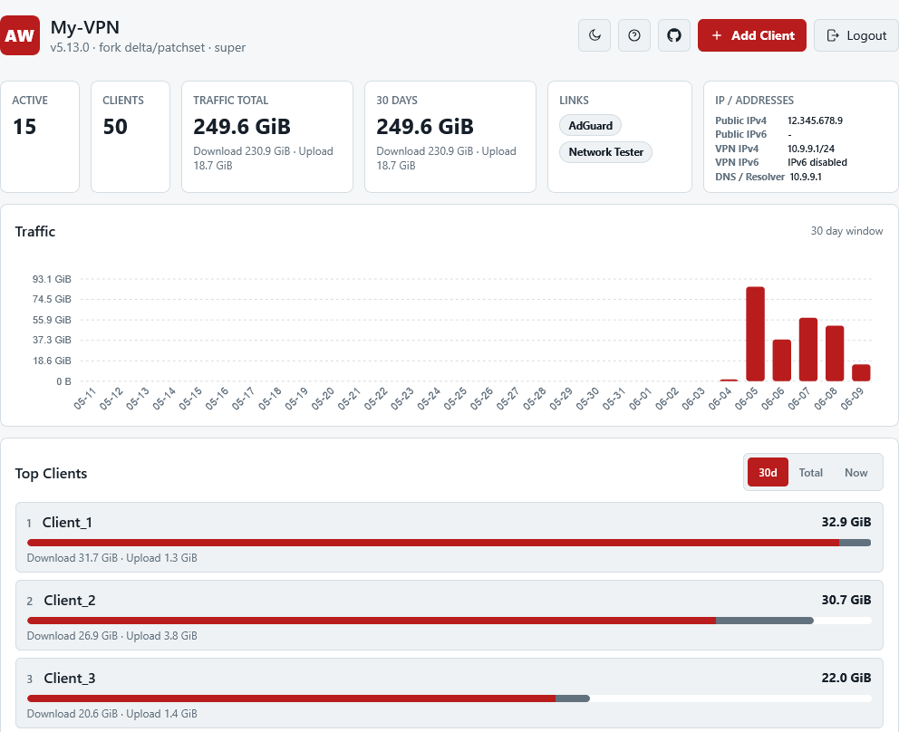
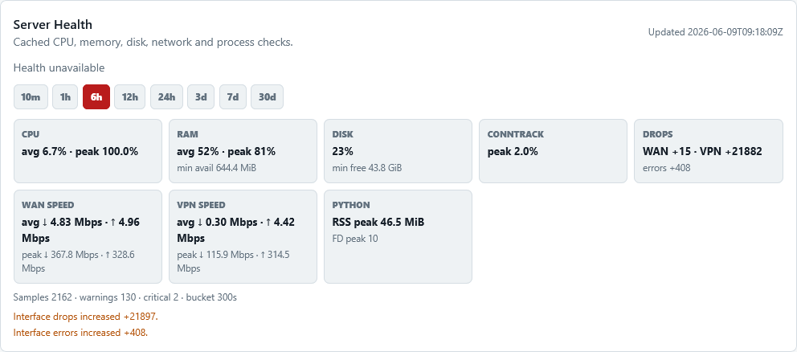

# AmneziaWG Installer


An installer and administration toolkit for deploying AmneziaWG servers on Ubuntu and Debian. It creates the tunnel, client profiles, QR codes and VPN URIs, with IPv6, split/full-tunnel routing, client isolation, P2P/DNAT, AdGuard Home, a web panel and a Telegram bot.

This project is a fork of [`bivlked/amneziawg-installer`](https://github.com/bivlked/amneziawg-installer). It keeps the upstream compatibility surface and adds security fixes, network modes, operator presets, domain-first endpoints, WireSock hints and AmneziaWG 3.1 profile integration.

## Quick installation

Supported systems are Ubuntu 24.04, 25.10 and 26.04, plus Debian 12 and Debian 13, on x86_64, ARM64 and ARMv7.

```bash
curl -fsSL https://raw.githubusercontent.com/Basil-AS/amneziawg-installer/main/install_amneziawg_en.sh -o install_amneziawg_en.sh
sudo bash install_amneziawg_en.sh
sudo bash ./install_amneziawg.sh --yes --route-all --server-name="my-vpn"
```

Use `install_amneziawg.sh` for the Russian interface.

The Russian installer is available from the same fork URL: `https://raw.githubusercontent.com/Basil-AS/amneziawg-installer/main/install_amneziawg.sh`.

```bash
sudo bash ./install_amneziawg.sh --yes --route-all --server-name="my-vpn"
sudo bash ./install_amneziawg_en.sh --preset=mobile
sudo bash ./install_amneziawg_en.sh --awg-version=3.1
```

The installer checks the OS, architecture, network and free space, downloads SHA256-pinned assets and persists installation state for safe resume. For AWG 3.1 it first probes the module on a temporary interface, applies a configuration and reads it back with `awg show`. If the probe fails, new configurations are not written.

## How it works

1. Detect the OS, network, default route, external interface and package sources.
2. Install the AmneziaWG module and tools, then create keys with restricted permissions.
3. Generate obfuscation parameters and server/client configurations.
4. Enable `awg-quick`, firewall/NAT, DNS routes and selected optional services.
5. Generate a client `.conf`, QR code and VPN URI.

The main installed paths are `/root/awg` and `/etc/amnezia/amneziawg`. Private keys and `HeaderProtectionKey` are never logged; the profile containing the key is mode `0600`.

## Protocol versions

| Version | Use case | Option |
|---|---|---|
| 1.5 | Older clients | `--awg-version=1.5` |
| 2.0 | Tested legacy mode | `--awg-version=2.0` |
| 3.0 | AWG 3.x without 3.1-only fields | `--awg-version=3.0` |
| 3.1 | Recommended mode with capability probing | `--awg-version=3.1` |

3.1 is the default. The version is not selected by a kernel-version guess: actual `setconf` plus read-back is authoritative for 3.1. Server and client profiles must use the same version.

## Mobile networks

`--preset=mobile` targets LTE/5G, CGNAT and unstable roaming. It uses moderate junk/padding sizes, non-overlapping H ranges, `S4 >= 12` and a 25-35 second `KeepaliveTimeout` range for AWG 3.1.

Keep `PersistentKeepalive = 25`, use a short-TTL domain when the VPS address changes and start MTU troubleshooting at 1280. Download a fresh client profile or QR code after rotating parameters. A preset cannot bypass a network that blocks UDP by itself.

## Features

- IPv4 full-tunnel, split-tunnel and custom `AllowedIPs`;
- IPv6 through the tunnel, NDP proxy, NAT66 and leak-block mode;
- DNS routes, client isolation, P2P and DNAT;
- AdGuard Home, web panel and Telegram bot;
- WireSock compatibility hints, operator presets and domain-first endpoints.

IPv6 offers `auto` | Auto-select, a separate routed IPv6 prefix, NDP proxy, NAT66 and leak-block mode. Routed mode uses a separate routed IPv6 prefix; NDP mode accounts for the current public `/64` on `eth0`/the external interface.

Use `--psk` for an additional PresharedKey; compatibility with clients such as Shadowrocket is documented in [ADVANCED.en.md#manage-cli-adv](ADVANCED.en.md#manage-cli-adv).

<details>
<summary>Example: my_iphone with PresharedKey</summary>

```bash
sudo /root/awg/manage_amneziawg_en.sh add my_iphone --psk
```
</details>

Pressing Enter at the Web Panel access step keeps the safe VPN-only URL on the selected subnet gateway. The final URL for port `443` is shown without `:443`; your own domain + Let’s Encrypt is best-effort because they share Let’s Encrypt rate limits, and TCP/80 must be open in the provider firewall/security group.

When no domain is configured, the panel uses a self-signed certificate and safe VPN-only access.

Manage an installation with:

```bash
sudo /root/awg/manage_amneziawg_en.sh --help
```

## Screenshots





## Security

Read [SECURITY.md](SECURITY.md). Never publish `.conf` files, QR codes, VPN URIs, private keys, panel tokens or `HeaderProtectionKey`. Report vulnerabilities using the process in `SECURITY.md`, not a public issue.

## Documentation

- [VPS installation](INSTALL_VPS.md)
- [Advanced configuration](ADVANCED.en.md)
- [Changelog](CHANGELOG.en.md)
- [Contributing](CONTRIBUTING.md)
- [Russian README](README.md)

## License and origin

The project is released under the MIT License. It is a fork of `bivlked/amneziawg-installer`; fork-specific changes are tracked in [FORK_PATCHSET.md](FORK_PATCHSET.md).
