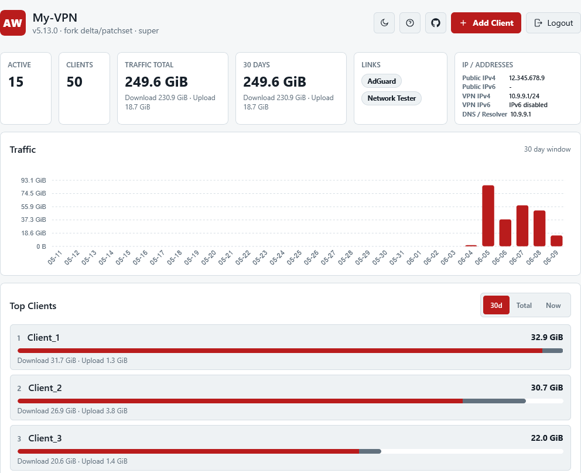
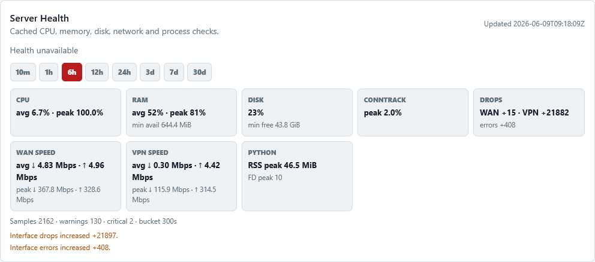

<a id="top"></a>
<p align="center">
  <b>RU</b> Русский | <b>EN</b> <a href="README.en.md">English</a>
</p>

<p align="center"><em>Форк оригинального AmneziaWG installer: upstream-совместимая база + IPv6, P2P-порты и веб-панель</em></p>

<p align="center">
  
  <br>
  
</p>

<h1 align="center">Install AmneziaWG 2.0 VPN on Ubuntu and Debian VPS</h1>

<p align="center"><em>VPN за одну команду - работает там, где WireGuard блокируют. Любой VPS за $3, без знания Linux.</em></p>
<p align="center"><em>One-command, self-hosted AmneziaWG 2.0 VPN for Ubuntu 24.04 / 25.10 / 26.04 and Debian 12 / 13. Kernel-native DKMS, no Docker, no web panel, runs on any cheap VPS.</em></p>

<p align="center">
  <a href="https://bivlked.github.io/amneziawg-installer/ru/"></a>
  
  
  
  <a href="https://github.com/bivlked/amneziawg-installer/blob/main/LICENSE"></a>
  
  <a href="https://github.com/bivlked/amneziawg-installer/releases"></a>
  
  
  
  <a href="https://github.com/bivlked/amneziawg-installer/blob/main/LICENSE"></a>
  <a href="https://github.com/bivlked/amneziawg-installer/releases"></a>
  <a href="https://github.com/bivlked/amneziawg-installer/actions/workflows/test.yml"></a>
  <a href="https://github.com/bivlked/amneziawg-installer/stargazers"></a>
  
  <a href="https://deepwiki.com/bivlked/amneziawg-installer"></a>
</p>

<p align="center">
  <b>В ядре, без Docker и панелей - нет накладных расходов</b> &nbsp;|&nbsp; <b>сервер только под VPN, защита из коробки</b> &nbsp;|&nbsp; <b>поставил и забыл</b> &nbsp;|&nbsp; <b>QR-код или vpn:// в один тап</b>
</p>

<a id="quickstart"></a>
## 🚀 Быстрый старт

```bash
wget -O install_amneziawg.sh https://raw.githubusercontent.com/bivlked/amneziawg-installer/v5.19.2/install_amneziawg.sh
chmod +x install_amneziawg.sh
sudo bash ./install_amneziawg.sh
```

> Что делает: ставит AmneziaWG 2.0 (модуль ядра через DKMS), настраивает firewall и форвардинг, создаёт первого клиента, печатает QR-код и `vpn://` ссылку для импорта в Amnezia Client. Добавить друга или устройство потом - одна команда `add`.
> 3 команды. 2 перезагрузки по ходу. Около 20 минут до готового VPN. Для чистого Ubuntu/Debian VPS, не роутер и не shared-хостинг. [Подробнее →](#ustanovka)

> 📘 Полный гайд по развёртыванию (EN): [Install AmneziaWG VPN server on Ubuntu/Debian VPS](INSTALL_VPS.md) - выбор VPS, ARM, troubleshooting, удаление.

> 🔐 Целостность: скрипт качается по HTTPS с `raw.githubusercontent.com` (тег закреплён), вспомогательные скрипты (`awg_common`, `manage`) проверяются по закреплённым SHA256-хешам. Отдельные detached-подписи релизов пока не активны (запланированы) - статус и модель угроз в [SECURITY.md](SECURITY.md).

<details>
<summary><strong>Что установщик меняет на сервере (прозрачность)</strong></summary>

Скрипт получает root - вот краткий список того, что он делает с системой:

- **Пакеты**: обновляет систему, ставит зависимости (amneziawg-tools, qrencode и т.д.); вычищает ненужное на VPN-сервере - в т.ч. `unattended-upgrades` (значит, обновления безопасности перестают ставиться автоматически) и `cloud-init`, если он не управляет сетью (полный список в [ADVANCED.md](ADVANCED.md)).
- **Ядро**: подключает PPA Amnezia (GPG-ключ проверяется по полному отпечатку) и собирает модуль AmneziaWG через DKMS.
- **Сеть**: sysctl - форвардинг, сетевые буферы, BBR (отдельными файлами в `/etc/sysctl.d/`); IPv6 на хосте по умолчанию выключается (оставить: `--allow-ipv6`); swap подгоняется под размер RAM.
- **Защита**: UFW - входящие запрещены, SSH с rate-limit, открыт только UDP-порт VPN; Fail2Ban для SSH.
- **Файлы и сервисы**: основные файлы в `/root/awg/` и `/etc/amnezia/amneziawg/` с правами 600/700; сервис `awg-quick@awg0`; крон автоудаления истёкших клиентов.
- **Откат**: `--uninstall` убирает своё - модуль, конфиги, sysctl-файлы, кроны, UFW-правило VPN-порта и UFW-правило маршрутизации `awg0`. UFW отключает и Fail2Ban удаляет только если сам их включал/ставил; если UFW был активен до установки, добавленное правило SSH rate-limit остаётся. Не возвращает: swap и удалённые пакеты.

Пошаговые детали - в [ADVANCED.md](ADVANCED.md), модель угроз - в [SECURITY.md](SECURITY.md).
</details>

<details>
<summary><strong>Неинтерактивная установка (для автоматизации)</strong></summary>

```bash
sudo bash ./install_amneziawg.sh --yes --route-all
```

Все параметры принимаются автоматически. Подробнее: [ADVANCED.md#cli-params-adv](ADVANCED.md#cli-params-adv)
</details>

### 🎯 Выберите свой случай

| Ваша ситуация | Что добавить |
|---|---|
| Обычный дешёвый VPS, просто нужен VPN | Ничего - команда выше уже всё делает |
| Мобильный интернет, DPI режет (ТСПУ, Иран, школа или корпоратив) | При установке добавьте `--preset=mobile` ([проверенные операторы](#operatory)) |
| ARM: Raspberry Pi, Oracle Ampere, Hetzner CAX | Та же команда - готовые ARM-модули ядра выберутся автоматически ([детали](INSTALL_VPS.md)) |
| Доступ другу или гостю на время | После установки: `manage_amneziawg.sh add guest --expires=7d` |

---

<p align="center">
  <a href="#zachem">Зачем это нужно</a> •
  <a href="#sravnenie">AWG vs WG</a> •
  <a href="#cli-vs-panel">CLI vs панели</a> •
  <a href="#similar-tools">Похожие инструменты</a> •
  <a href="#quickstart">Быстрый старт</a> •
  <a href="#fork-delta">Отличия форка</a> •
  <a href="#vozmozhnosti">Что умеет</a> •
  <a href="#operatory">Операторы</a> •
  <a href="#trebovaniya">Требования</a> •
  <a href="#recomend-hosting">Хостинг</a> •
  <a href="#ustanovka">Установка</a> •
  <a href="#posle-ustanovki">После установки</a> •
  <a href="#upravlenie">Управление</a> •
  <a href="#dopolnitelno">Дополнительно</a> •
  <a href="#roadmap">Планы</a> •
  <a href="#faq-main">FAQ</a> •
  <a href="#nepoladki">Устранение неполадок</a> •
  <a href="#ekosistema">Экосистема</a> •
  <a href="#licenziya">Лицензия</a>
</p>

<a id="quickstart"></a>
# AmneziaWG Installer Fork

Это форк `amneziawg-installer` с лёгкой web-panel на Python stdlib, HTTPS, bearer token / `tokens.json`, RBAC/access tokens, IPv6 `routed|ndp|nat66|legacy`, P2P/DNAT, AdGuard Home integration, `vpn://` URI, QR/config integration и диагностикой UDP/voice.

## 🚀 Быстрый старт

### Обновить уже установленный сервер — одна команда

Запустите **на самом VPN-сервере**:

```bash
sudo bash -c 'set -euo pipefail; d=$(mktemp -d); base=https://github.com/Basil-AS/amneziawg-installer/releases/latest/download; curl -fsSL --proto "=https" --tlsv1.2 "$base/update-installed.sh" -o "$d/update-installed.sh"; curl -fsSL --proto "=https" --tlsv1.2 "$base/update-installed.sh.sha256" -o "$d/update-installed.sh.sha256"; (cd "$d" && sha256sum -c update-installed.sh.sha256); install -m 700 "$d/update-installed.sh" /root/awg/update-installed.sh; rm -rf "$d"; /root/awg/update-installed.sh'
```

Команда получает updater из последнего стабильного GitHub Release, проверяет SHA-256 до
запуска и устанавливает его в `/root/awg/update-installed.sh`. Updater проверяет текущую
версию, AWG-конфигурацию, tunnel/interface, IPv4/IPv6 forwarding, generated hooks и активные
web/AdGuard services; скачивает runtime-bundle только после проверки опубликованной SHA-256; создаёт
root-only rollback snapshot; атомарно обновляет проектные файлы; перезапускает только
`awg-web`, не прерывая VPN tunnel. Если итоговый health-check не проходит, старые файлы
восстанавливаются автоматически. Ключи, peers, клиентские конфиги, `tokens.json`, AdGuard
data и firewall/P2P hooks updater не перезаписывает.

Дополнительные безопасные режимы:

```bash
sudo /root/awg/update-installed.sh --check       # только версии и health-check
sudo /root/awg/update-installed.sh --dry-run     # скачать и проверить, ничего не менять
sudo /root/awg/update-installed.sh --install-timer  # opt-in weekly auto-update
```

Автообновление намеренно не включается установщиком без явной команды.

### Безопасная установка по умолчанию

```bash
wget -O install_amneziawg.sh https://raw.githubusercontent.com/Basil-AS/amneziawg-installer/main/install_amneziawg.sh
chmod +x install_amneziawg.sh
sudo bash ./install_amneziawg.sh --yes --route-all --server-name="my-vpn"
```

`--route-all` — направить весь трафик клиента через VPN.  
`--server-name="my-vpn"` — человекочитаемое имя сервера в панели и конфигурациях.

### Интерактивная установка без флагов

```bash
sudo bash ./install_amneziawg.sh
```

Wizard спросит важные параметры до начала установки: имя сервера, endpoint/public IP или автоопределение, route mode, preset `default|mobile`, IPv6 mode `auto|routed|ndp|nat66`, IPv6 subnet для `routed`, режим доступа к web-panel (`VPN-only`, `localhost`, `public`), HTTPS-порт web-panel, AdGuard Home и P2P-порты. Для fresh install внутренняя `/24` детерминированно выбирается для конкретного сервера из `10.64.0.0/10`; явный `--subnet` имеет приоритет. Enter на шаге доступа к Web Panel оставляет безопасный VPN-only URL на шлюзе выбранной подсети и порту `8443`; для публичного домена нужно выбрать `public`, тогда domain modes (`ip-domain`, `letsencrypt`, `custom`) по умолчанию используют `443`. Для trusted HTTPS рекомендуется свой домен + Let's Encrypt; `sslip.io`/`nip.io` удобны, но best-effort из-за общих rate limits Let's Encrypt. Перед установкой будет показан итоговый summary; выбранные значения сохраняются в `/root/awg/awgsetup_cfg.init`, чтобы resume после reboot не вернулся к default preset/bind.

### Non-interactive install через flags

Для автоматизации передавайте параметры флагами. CLI имеет приоритет над сохранённым config и wizard-вопросами:

```bash
sudo bash ./install_amneziawg.sh \
  --yes \
  --route-all \
  --endpoint=203.0.113.10 \
  --server-name="my-vpn" \
  --preset=mobile \
  --web-port=8443 \
  --enable-adguard \
  --adguard-port=3000
```

### Расширенный пример с routed IPv6 и публичной web-panel

```bash
sudo bash ./install_amneziawg.sh \
  --yes \
  --route-all \
  --endpoint=64.112.125.125 \
  --allow-ipv6 \
  --enable-native-ipv6 \
  --ipv6-mode=routed \
  --ipv6-subnet=2a13:7c82:101f:30::/64 \
  --server-name="sunny-sweden" \
  --web-bind=0.0.0.0 \
  --web-port=8443 \
  --preset=mobile
```

### Для разработчиков / кастомной ветки

Если вы тестируете свой fork или ветку, сначала клонируйте нужный репозиторий:

```bash
git clone https://github.com/Basil-AS/amneziawg-installer.git
cd amneziawg-installer
sudo bash ./install_amneziawg.sh
```

### Доступ к web-panel

По умолчанию web-panel доступна только на IPv4 gateway выбранной VPN-подсети. Точный URL записывается в `/root/awg/INSTALL_SUMMARY.txt`, например для явно заданного `--subnet=10.9.9.1/24`:

```text
https://10.9.9.1:8443
```

Подключите VPN-клиент и откройте этот адрес в браузере. Если вы осознанно установили `--web-bind=127.0.0.1`, используйте SSH tunnel как fallback-вариант:

```bash
ssh -L 8443:127.0.0.1:8443 root@SERVER_IP
```

Затем откройте:

```text
https://127.0.0.1:8443
```

### Публичная web-panel, если очень нужно

```bash
sudo bash install_amneziawg.sh \
  --web-bind=0.0.0.0 \
  --web-cert-mode=ip-domain \
  --web-cert-provider=sslip.io \
  --web-port=443
```

Интерактивный wizard для публичной панели рекомендует trusted HTTPS через свой домен + Let's Encrypt. Pseudo-domain вида `https://64-112-125-125.sslip.io/` или `nip.io` доступен как экспериментальный вариант: он удобен, но может упереться в лимиты Let's Encrypt для registered domain `sslip.io`/`nip.io`. Итоговый URL для port `443` пишется без `:443`. Для выпуска сертификата порт `80/tcp` должен быть доступен и в UFW, и во внешнем firewall/security group провайдера. Для публичной панели на `443` также откройте TCP/443. VPN-only и localhost остаются на `8443` по умолчанию.

> Открывать web-panel всему интернету не рекомендуется. Лучше использовать firewall allowlist, VPN, SSH tunnel или reverse proxy с дополнительной авторизацией. Публичный self-signed режим не рекомендуется: браузеры и WG Tunnel URL Import могут отклонять сертификат. Bearer token должен быть длинным и секретным; не публикуйте `tokens.json`, client configs, QR и `vpn://` URI.

Если панель всё же публикуется наружу, Python stdlib HTTP server следует считать лёгкой admin-panel, а не полноценным public edge. Предпочтительные варианты: bind на IPv4 gateway выбранной VPN-подсети, `127.0.0.1` + SSH tunnel, либо nginx/caddy reverse proxy с TLS, timeouts и connection limits. Минимальный nginx-фрагмент:

```nginx
client_header_timeout 5s;
client_body_timeout 10s;
send_timeout 10s;
limit_conn_zone $binary_remote_addr zone=awgpanel:10m;
limit_conn awgpanel 10;
```

Troubleshooting Let's Encrypt:

* `Timeout during connect` / `likely firewall problem`: проверьте, что домен указывает на IP сервера, TCP/80 открыт в UFW, TCP/80 открыт во внешнем firewall/security group, и на сервере нет процесса, который уже слушает `:80`.
* `too many certificates` / `rate limit` для `sslip.io` или `nip.io`: используйте свой домен, выберите self-signed fallback, принесите custom cert или дождитесь reset лимита.
* Если выпуск сертификата не удался, VPN всё равно может быть установлен; Web Panel продолжит работать с self-signed HTTPS до настройки trusted cert.

## Частые сценарии установки

```bash
# Минимальная установка
sudo bash install_amneziawg.sh

# Web-panel только внутри VPN (default; bind вычисляется из tunnel subnet)
sudo bash install_amneziawg.sh --web-port=8443

# Web-panel только на localhost, если нужен SSH tunnel
sudo bash install_amneziawg.sh --web-bind=127.0.0.1 --web-port=8443

# Публичная web-panel с trusted HTTPS через sslip.io + Let's Encrypt
sudo bash install_amneziawg.sh --web-bind=0.0.0.0 --web-cert-mode=ip-domain --web-cert-provider=sslip.io --web-port=443

# Публичная web-panel со своим доменом + Let's Encrypt
sudo bash install_amneziawg.sh --web-bind=0.0.0.0 --web-cert-mode=letsencrypt --web-domain=vpn.example.com --web-port=443

# IPv6 через NDP proxy
sudo bash install_amneziawg.sh --enable-native-ipv6 --ipv6-mode=ndp

# IPv6 NAT66/ULA fallback
sudo bash install_amneziawg.sh --enable-native-ipv6 --ipv6-mode=nat66

# Routed IPv6 при наличии routed prefix
sudo bash install_amneziawg.sh --enable-native-ipv6 --ipv6-mode=routed --ipv6-subnet=2001:db8:1234:1::/64

# AdGuard Home integration
sudo bash install_amneziawg.sh --enable-adguard --dns-mode=adguard
```

AdGuard Home получает curated `user_rules` для популярных advertising/analytics domains. Если DNS клиентов указывает на локальный AdGuard (IPv4 gateway выбранной tunnel subnet или IPv6 tunnel address), split AllowedIPs modes автоматически добавляют точный маршрут к DNS-серверу, не ломая LAN exclusions и не меняя route-all mode.

IPv6 modes:

| Mode | Когда использовать |
| --- | --- |
| `auto` | Автовыбор: `routed` только если явно передан отдельный provider-routed prefix, иначе `ndp` при найденной текущей публичной `/64` на внешнем интерфейсе, иначе `nat66` |
| `routed` | Провайдер выдал отдельный routed IPv6 prefix (`/64`, `/56`, `/48`) именно под VPN-клиентов |
| `ndp` | У сервера уже есть текущая публичная `/64` на `eth0`/внешнем интерфейсе; клиентские IPv6 будут анонсироваться через NDP proxy |
| `nat66` | Fallback через NAT66, если routed prefix/NDP не подходят |
| `block` | IPv6 leak-block для full-tunnel: `::/0` уходит в туннель, но клиентский IPv6 адрес не выдаётся, чтобы native IPv6 оператора не обходил VPN |

Если Android/мобильный оператор выдаёт native IPv6, IPv4-only full tunnel может протекать по IPv6. Используйте `routed`/`ndp`/`nat66`, если у сервера есть рабочий IPv6 путь, либо `--ipv6-mode=block` для явной leak-block политики. WebRTC leaks дополнительно зависят от браузера: Network Tester показывает IPv6/WebRTC risk и даёт клиентские рекомендации.

P2P/DNAT включается и управляется после установки:

```bash
sudo /root/awg/manage_amneziawg.sh p2p add CLIENT_NAME PORT
sudo /root/awg/manage_amneziawg.sh p2p remove CLIENT_NAME PORT
sudo /root/awg/manage_amneziawg.sh p2p toggle CLIENT_NAME
```

## Важные флаги installer-а

| Флаг | Что делает | Пример |
| --- | --- | --- |
| `--yes` | Запуск без интерактивных подтверждений | `sudo bash install_amneziawg.sh --yes` |
| `--web-bind=ADDR` | IP, на котором слушает web-panel. По умолчанию IPv4 gateway выбранной tunnel subnet | `--web-bind=0.0.0.0` |
| `--web-port=PORT` | HTTPS-порт web-panel. VPN-only/localhost default `8443`; public trusted HTTPS default `443` в wizard/fresh install | `--web-port=443` |
| `--disable-web` | Не разворачивать web-panel | `--disable-web` |
| `--enable-native-ipv6` | Совместимый алиас для включения IPv6 клиентов | `--enable-native-ipv6` |
| `--disallow-ipv6` | Принудительно отключить IPv6 | `--disallow-ipv6` |
| `--ipv6-mode=MODE` | IPv6 mode: `auto`, `routed`, `ndp`, `nat66`, `block` | `--ipv6-mode=auto` |
| `--ipv6-subnet=CIDR` | IPv6 prefix для клиентов | `--ipv6-subnet=2001:db8:1::/64` |
| `--upgrade-ipv6` | Добавить IPv6/P2P metadata существующим клиентам | `--upgrade-ipv6` |
| `--p2p-base-port=PORT` | Базовый диапазон P2P-портов | `--p2p-base-port=20000` |
| `--p2p-ports-per-client=N` | Сколько P2P-портов выдать новому клиенту | `--p2p-ports-per-client=3` |
| `--wiresock-hints=MODE` | Добавить безопасные WireSock comments `#@ws:*` в клиентские конфиги. По умолчанию `off` | `--wiresock-hints=mobile` |
| `--fullcone-nat` | Попробовать `FULLCONENAT`, иначе fallback на `MASQUERADE` | `--fullcone-nat` |
| `--enable-adguard` | Установить AdGuard Home | `--enable-adguard` |
| `--dns-mode=MODE` | DNS mode: `adguard`, `system`, `custom` | `--dns-mode=adguard` |
| `--route-all` | Весь трафик через VPN | `--route-all` |
| `--route-amnezia` | Маршрутизация по Amnezia list | `--route-amnezia` |
| `--ssh-port=PORT[,PORT]` | SSH-порт(ы), которые нужно открыть в UFW; обычно определяется автоматически | `--ssh-port=2222` |
| `--endpoint=IP` | Внешний IP сервера за NAT | `--endpoint=203.0.113.10` |
| `--preset=TYPE` | Preset обфускации: `default` или `mobile` | `--preset=mobile` |
| `--no-tweaks` | Пропустить hardening/оптимизацию | `--no-tweaks` |
| `--disable-ufw` | Не включать UFW, если firewall/NAT управляются снаружи | `AWG_DISABLE_UFW=1` |
| `--web-cert-mode=selfsigned\|custom\|letsencrypt\|ip-domain` | TLS mode web-panel. Default `selfsigned` для VPN-only/localhost; public wizard рекомендует `letsencrypt` со своим доменом. `ip-domain` (`sslip.io`/`nip.io`) best-effort из-за rate limits. `custom` требует `--web-cert-file`/`--web-key-file`; Let's Encrypt требует доступный `80/tcp` | `--web-cert-mode=letsencrypt` |
| `--web-cert-provider=sslip.io\|nip.io` | Provider для `ip-domain`; `64.112.125.125` превращается в `64-112-125-125.sslip.io` | `--web-cert-provider=sslip.io` |
| `--web-domain=DOMAIN` | Домен для `letsencrypt` или public URL при custom cert | `--web-domain=vpn.example.com` |
| `--web-cert-fallback=selfsigned\|abort` | Non-interactive fallback при ошибке Let's Encrypt. Default `abort`; `selfsigned` продолжит установку с недоверенным cert | `--web-cert-fallback=selfsigned` |

Полный список — в `sudo bash install_amneziawg.sh --help`.

## Команды управления после установки

```bash
sudo /root/awg/manage_amneziawg.sh list
sudo /root/awg/manage_amneziawg.sh add CLIENT_NAME
sudo /root/awg/manage_amneziawg.sh remove CLIENT_NAME
sudo /root/awg/manage_amneziawg.sh toggle CLIENT_NAME
sudo /root/awg/manage_amneziawg.sh stats
sudo /root/awg/manage_amneziawg.sh restart
sudo /root/awg/manage_amneziawg.sh diagnose
sudo /root/awg/manage_amneziawg.sh web token list
sudo /root/awg/manage_amneziawg.sh web token status
sudo /root/awg/manage_amneziawg.sh web token check <token>
sudo /root/awg/manage_amneziawg.sh set-name "My VPN"
sudo /root/awg/manage_amneziawg.sh voice-check
sudo /root/awg/manage_amneziawg.sh udp-check
sudo /root/awg/manage_amneziawg.sh dns status
sudo /root/awg/manage_amneziawg.sh dns restart
```

## Security notes

* Web-panel по умолчанию bind-ится к IPv4 gateway выбранной tunnel subnet и доступна только подключённым VPN-клиентам.
* Static serving ограничен allowlist: `index.html`, `style.css`, `app.js`, `favicon.svg`.
* Private files вроде `tokens.json`, `import_tokens.json`, `auth_token`, `key.pem`, `cert.pem`, `server.py` не отдаются как static HTTP.
* `tokens.json`, `import_tokens.json` и `/root/awg/INSTALL_SUMMARY.txt` хранят секреты или token hashes и должны оставаться приватными.
* Не публикуйте client configs, QR и `vpn://` URI.
* WG Tunnel import links требуют HTTPS, отдают raw config text и истекают; self-signed сертификат может не пройти проверку в приложении.
* Для localhost-only режима используйте `--web-bind=127.0.0.1` и SSH tunnel; для публичной панели — firewall allowlist, VPN или reverse proxy с дополнительной авторизацией.


---

<a id="fork-delta"></a>
## 🔀 Это форк оригинального проекта

Этот репозиторий — форк [bivlked/amneziawg-installer](https://github.com/bivlked/amneziawg-installer), а не самостоятельная новая upstream-линейка. База намеренно обозначается как **upstream `v5.13.0`**, чтобы было проще подтягивать изменения из оригинала и видеть, поверх какой версии сделаны доработки.

Собственная версия форка — **`v5.19.2-bas.3`**. Формат `<upstream-sync>-bas.<revision>` сохраняет связь с оригиналом: `5.19.2` — текущий полный upstream sync marker, а `bas.3` — очередная fork-ревизия после синхронизации. История существующих коммитов и их даты не переписываются.

**Главные отличия форка от оригинала:**

* **Полноценный IPv6 для клиентов:** native `/64`, если провайдер/VPS даёт публичную подсеть, или явный `ULA fd.../64 + NAT66` fallback.
* **P2P-порты:** каждому клиенту автоматически выдаются TCP+UDP порты для торрентов, игр и self-hosted сервисов; дополнительные порты управляются через CLI и веб-панель.
* **Full Cone NAT попытка:** если доступен `FULLCONENAT`, используется он; если нет — скрипт возвращается к `MASQUERADE`.
* **Веб-панель:** HTTPS `:8443`, self-signed TLS, bearer token, список клиентов, добавление/удаление, скачивание и копирование `.conf`, QR/vpnuri, статистика, логи, рестарт сервиса, карточка DNS/AdGuard.
* **AdGuard Home DNS:** опциональная установка без Docker, DNS только на localhost/VPN, клиенты получают IPv4 gateway выбранной tunnel subnet и IPv6-адрес сервера при dual-stack.
* **Новые команды управления:** `diagnose`, `p2p list/show/add/remove`, `ipv6 status/upgrade`, `dns status/restart/logs/set-mode`.
* **Selected upstream fixes:** вручную перенесены QR/MTU/public-IP/diagnose/cleanup/ARM build fixes из upstream `5.14.0`-`5.14.3` без full merge и без смены upstream base.
* **Автогенерация firewall hooks:** `/root/awg/postup.sh`, `/root/awg/postdown.sh`, `/root/awg/p2p_rules.sh`.
* **Fork patchset:** версия upstream остаётся `5.13.0`, отличия живут как fork delta поверх неё.

**Правило версий:** fork-only релизы увеличивают `bas.N` (`5.19.2-bas.3`), а после перехода на новый upstream sync marker нумерация начинается заново. Старые коммиты и их даты не переписываются; версия указывается только в новых релизных коммитах и тегах.

> Команды установки ниже идут напрямую из ветки `main`. Текущий sync marker — upstream `v5.19.2`, версия форка — `v5.19.2-bas.3`.

---

<a id="zachem"></a>
## 💡 Зачем это нужно

[AmneziaWG](https://github.com/amnezia-vpn) - форк WireGuard с обфускацией трафика. Обфускация делает трафик трудноотличимым от случайного шума для систем DPI, поэтому там, где обычный WireGuard детектируют и блокируют, AmneziaWG обычно продолжает работать.

Этот набор скриптов превращает чистый VPS в готовый VPN-сервер. Не нужны знания Linux - скрипт сам настроит firewall, оптимизирует систему, создаст конфиги и QR-коды для клиентов.

Сервер настраивается под одну задачу - VPN: лишние пакеты убираются, ядро, сеть и swap тюнингуются под железо, включаются firewall и базовая защита. AmneziaWG работает в ядре, поэтому накладных расходов почти нет - быстро и экономно. Поставил один раз для дома или семьи и забыл: добавить друга или новое устройство через месяц - минута, конфиг и QR готовятся одной командой.

Работает на Ubuntu 24.04/25.10/26.04 и Debian 12/13. Хватит любого дешёвого VPS с 1 ГБ RAM.

---

<a id="sravnenie"></a>
## ⚖️ AmneziaWG vs WireGuard

| | WireGuard | AmneziaWG 2.0 |
|---|---|---|
| **Обнаружение DPI** | Детектируется по фиксированным размерам пакетов и magic bytes | Трудно зафингерпринтить - случайные заголовки, padding, имитация протоколов |
| **Блокируется в** | Китай, Россия, Иран, ОАЭ, Туркменистан | Не известно о блокировках (по состоянию на апрель 2026) |
| **Настройка сервера** | Вручную: ключи, iptables, sysctl, systemd | Одна команда, 20 минут, полностью автоматически |
| **Безопасность** | Сами: UFW, Fail2Ban, sysctl | Автоматически: firewall + защита от брутфорса + тюнинг ядра |
| **Управление клиентами** | Ручное редактирование конфигов, рестарт | `add`/`remove`/`list`/`stats` с hot-reload |
| **Временный доступ** | Нет | `--expires=7d` с автоматическим удалением |
| **Требования к серверу** | - | Те же - любой VPS за $3-5/мес, 1 ГБ RAM |
| **Потеря скорости** | Базовая | Минимальная (<2% в типичных тестах) |

> Если WireGuard у вас работает и не блокируется - используйте его. Если блокируется или режется - AmneziaWG 2.0 является прямой заменой.

---

<a id="cli-vs-panel"></a>
## ⚙️ CLI-инсталлер vs веб-панели

> **Задача — поднять VPN на дешёвом VPS за 20 минут.** Скрипт не тянет за собой Docker, базу данных и тяжёлый стек. После установки на сервере работает AWG, firewall и опциональная лёгкая Python stdlib веб-панель — минимум нагрузки, максимум ресурсов для VPN.

| | Этот проект (CLI) | Веб-панели на Docker |
|---|---|---|
| **Модуль AWG** | Kernel module — работает на уровне ядра | Userspace в контейнере |
| **Требования к серверу** | Любой VPS от 512 МБ RAM, Python3 для веб-панели | Нужны PHP/Python, БД, веб-сервер, Docker |
| **Поверхность атаки** | SSH + UDP-порт VPN + HTTPS-панель с bearer token | + HTTP-панель, база данных, Docker |
| **Установка** | Одна команда на сервере, 20 минут | docker-compose + передача SSH-доступа панели |
| **После перезагрузки** | Продолжит установку с того же шага | Зависит от состояния контейнеров и БД |
| **Веб-интерфейс** | ✅ Лёгкая встроенная панель без БД | ✅ GUI, управление через браузер |
| **Несколько протоколов** | Только AmneziaWG | WireGuard, OpenVPN, VLESS и другие |

> Нужен VPN без GUI на выделенном сервере - этот проект. Нужна веб-панель с несколькими протоколами - ищите Docker-решения.

---

<a id="similar-tools"></a>
## 🔧 Сравнение с похожими инструментами

Есть ещё несколько способов поднять AmneziaWG. Каждый выбирает свой компромисс:

| Инструмент | Способ | Кому подходит |
|---|---|---|
| **Этот установщик** | SSH + одна bash-команда | Headless VPS, single-purpose сервер, без Docker и панели, ARM-prebuilt'ы |
| **[wiresock/amneziawg-install](https://github.com/wiresock/amneziawg-install)** | SSH + bash, опц. нативная веб-панель и обфускация-прокси (Rust) | Нужна веб-панель без Docker или маскировка трафика отдельным сервисом |
| **[wg-easy](https://github.com/wg-easy/wg-easy)** | Docker + веб-интерфейс | Домашние боксы, на которых уже крутится Docker; нужна панель для клиентов |
| **[spcfox/amnezia-wg-easy](https://github.com/spcfox/amnezia-wg-easy)** | Docker-форк wg-easy | Те, кто уже на wg-easy и хочет именно AmneziaWG вместо обычного WireGuard |
| **[Amnezia VPN](https://amnezia.org/)** | Десктоп/моб GUI, разворачивает сервер в Docker по SSH | Установка кликами без терминала; нужен графический клиент |

Этот скрипт — путь без тяжёлого стека: SSH-first управление, лёгкая Python stdlib web-panel, kernel-level AmneziaWG и ARM-prebuilt'ы для дешёвых боксов. Если у вас уже стоит Docker и нужен многопротокольный GUI-комбайн — удобнее **wg-easy**. Если нужна установка кликами — десктоп-клиент **Amnezia VPN** имеет свой SSH-deploy.


<a id="fork-details"></a>
## 🌐 Подробности доработок форка: IPv6 + P2P + Web

Это переработка установщика и менеджера поверх upstream-базы `v5.13.0`. Старые установки без IPv6 продолжают работать как раньше, а включение IPv6 для уже существующих клиентов делается отдельной миграцией.

### Зачем это сделано

* **Нормальный IPv6 для VPN-клиентов.** Если VPS имеет публичный IPv6 `/64`, клиенты получают реальные IPv6-адреса и выходят в интернет без NAT66. Это полезно для современных сайтов, мобильных сетей, P2P и сервисов, которые лучше работают по IPv6.
* **Fallback без самообмана.** Если публичного `/64` нет, включается `ULA fd.../64 + NAT66`. Это даёт IPv6 внутри VPN и исходящий IPv6/NAT66, но это не public native IPv6 — скрипт явно предупреждает об этом.
* **P2P-порты для торрентов, игр и self-hosted сервисов.** Каждому клиенту выдаются TCP+UDP порты и генерируются DNAT/FORWARD правила.
* **Больше шансов на прямые UDP-сессии.** `FULLCONENAT` используется при наличии target-а, иначе скрипт откатывается на обычный `MASQUERADE`. Для Telegram/WhatsApp это не принудительный проброс звонка, а более благоприятные NAT-условия: сами мессенджеры всё равно решают, идти напрямую или через relay.
* **Веб-панель для повседневного управления.** Можно смотреть клиентов, добавлять/удалять, скачивать конфиги, открывать QR, смотреть логи и статистику без SSH-команд.

### Voice / Calls optimization

AmneziaWG — это L3 VPN. Для обычных звонков ему не нужен XUDP: XUDP относится к стеку Xray/VLESS/VMess и не является частью AWG. Для WebRTC и звонков установщик применяет безопасные UDP-настройки: `MTU 1280`, `PersistentKeepalive 25`, UDP conntrack timeout `120`, UDP conntrack stream timeout `300`, обычный `MASQUERADE`/`SNAT` и опциональные P2P-пробросы для приложений со статическими портами. Full Cone NAT по умолчанию не включается.

Звонки мессенджеров обычно используют ICE/STUN/TURN и динамические UDP-порты. P2P/DNAT-порты полезны для торрентов, игр и приложений со статическими портами, но звонки Telegram/WhatsApp/Discord обычно не требуют ручного port forwarding.

#### Voice / STUN test on Windows

Скачайте Windows binary STUNTMAN, распакуйте архив целиком (не только `stunclient.exe`), откройте PowerShell в папке и выполните:

```powershell
.\stunclient.exe stun.l.google.com 19302
.\stunclient.exe stun.cloudflare.com 3478
.\stunclient.exe stunserver2025.stunprotocol.org 3478
```

Ожидаемый результат: `Mapped address: <VPS_PUBLIC_IP>:<port>`. Если `Mapped address` показывает IP VPS, UDP/STUN через AWG работает. Сохранение порта, например `49340 -> 49340`, — хороший признак port-preserving NAT, но не гарантия Full Cone NAT.

### Как включить

Новая установка с попыткой native IPv6:

```bash
sudo bash ./install_amneziawg.sh --enable-native-ipv6
```

Новая установка с указанной IPv6-подсетью:

```bash
sudo bash ./install_amneziawg.sh --enable-native-ipv6 --ipv6-subnet=2001:db8:1234:1::/64
```

Миграция уже установленного сервера:

```bash
sudo bash ./install_amneziawg.sh --upgrade-ipv6
```

Полезные флаги:

```bash
--p2p-base-port=20000        # управляемый диапазон: 20001-21024
--p2p-ports-per-client=3     # сколько портов выдавать новому клиенту
--fullcone-nat               # пытаться использовать FULLCONENAT
--web-port=8443              # HTTPS-порт веб-панели
--web-bind=VPN_GATEWAY_IP    # optional override; default берётся из tunnel subnet
--disable-web                # не разворачивать веб-панель
--enable-adguard             # установить AdGuard Home и выдать DNS на VPN gateway
--adguard-port=3000          # UI AdGuard на VPN-адресе
--dns-mode=adguard|system|custom
```

### Как это устроено

* В `/root/awg/awgsetup_cfg.init` добавлены ключи `AWG_IPV6_*`, `AWG_P2P_*`, `AWG_FULLCONE_NAT`, `AWG_WEB_*`, `AWG_DNS_MODE`, `AWG_ADGUARD_*`.
* Серверный конфиг получает dual-stack `Address` и внешние hooks:
  `PostUp = /bin/bash /root/awg/postup.sh`,
  `PostDown = /bin/bash /root/awg/postdown.sh`.
* Peer-блоки в `/etc/amnezia/amneziawg/awg0.conf` стали источником истины:
  `AllowedIPs = 10.9.9.X/32, <ipv6>/128` и `#_P2PPorts = p1,p2,p3`.
* Новому клиенту с IPv4 last octet `N` выдаются порты `20000+N`, `20256+N`, `20512+N`. Дополнительные порты берутся из свободных в диапазоне `20001-21024`.
* Firewall/NAT генерируется idempotent-скриптами:
  `/root/awg/postup.sh`, `/root/awg/postdown.sh`, `/root/awg/p2p_rules.sh`.
* Для native IPv6 с NDP proxy создаётся `/etc/ndppd.conf`. Для ULA-режима используется NAT66.
* Веб-панель разворачивается в `/root/awg/web/`, по умолчанию слушает HTTPS только на IPv4 gateway выбранной tunnel subnet и порту `8443`, использует локальные assets без внешних CDN, self-signed сертификат и bearer tokens/RBAC через `tokens.json`.
* В карточке клиента есть явные действия: скачать `.conf`, скопировать полный текст конфига, показать QR, скопировать `vpn://` и создать WG Tunnel import URL. Config/import-link endpoints остаются под auth и RBAC.
* WG Tunnel import URL создаётся через `POST /api/clients/<name>/import-link`, живёт 1 час по умолчанию и отдаётся как raw `text/plain` через `GET /import/<client>/<token>` без `Content-Disposition`.
* Имена клиентов намеренно ASCII-only: используйте только `A-Z`, `a-z`, `0-9`, `_` и `-` (`my_phone`, `iphone_15`, `laptop-home`).
* AdGuard Home ставится в `/opt/AdGuardHome`, слушает DNS на `127.0.0.1`, IPv4 gateway выбранной tunnel subnet и серверном IPv6 внутри VPN. Если сервис не стартует, VPN остаётся рабочим; fallback: `manage dns set-mode system`.

### Веб-панель

По умолчанию web-panel доступна подключённым VPN-клиентам на IPv4 gateway выбранной tunnel subnet. Точный URL смотрите в `/root/awg/INSTALL_SUMMARY.txt`, например:

```text
https://10.9.9.1:8443
```

Если вы установили `--web-bind=127.0.0.1`, используйте SSH tunnel:

```bash
ssh -L 8443:127.0.0.1:8443 root@SERVER_IP
```

Super token печатается при первой установке, а token hashes и RBAC access tokens хранятся в приватном файле:

```bash
/root/awg/web/tokens.json
```

После успешной установки создаётся `/root/awg/INSTALL_SUMMARY.txt`: наверху лежат реальные Public/VPN/Local URL web-panel, Trusted HTTPS/cert fallback, super token первого запуска или команда reset, AdGuard credentials и файлы каждого клиента, сгруппированные по имени. Файл содержит секреты, получает права `0600`, а предыдущая версия сохраняется как `INSTALL_SUMMARY.txt.bak.<timestamp>`. Финальный console output использует те же вычисленные URL и больше не печатает placeholder-адреса.

Обычные user-token видят только назначенных им клиентов и не могут создавать новых. У токена может быть необязательный alias/name:

```bash
sudo bash /root/awg/manage_amneziawg.sh web token create --client my_phone --name "phone token"
sudo bash /root/awg/manage_amneziawg.sh web token create --client my_phone
sudo bash /root/awg/manage_amneziawg.sh web token list
```

Alias хранится как metadata, не является секретом и экранируется в Web UI. При fresh install и `reset-super` хранится только hash super token, raw token проверяется перед выводом и показывается один раз. Если `tokens.json` повреждён, панель не перегенерирует доступ молча: сбросьте super-token через `manage web token reset-super`.

Публичный bind (`--web-bind=0.0.0.0` или `::`) открывает панель наружу и сопровождается warning; безопасный default остаётся VPN-only/local-first.

Для WG Tunnel и WireGuard-like клиентов в карточке клиента есть кнопка `Import URL`: панель создаёт короткоживущую HTTPS-ссылку вида `/import/<client>/<token>`, защищённую random token. Ссылка возвращает только raw `text/plain` конфиг, начинающийся с `[Interface]`, без HTML/JSON/download-страницы; raw token хранится только у пользователя, на сервере лежит hash в `/root/awg/web/import_tokens.json`. По умолчанию TTL 1 час, self-signed TLS может быть отклонён мобильным приложением, поэтому для URL Import лучше использовать доверенный домен/сертификат.

Кнопка `Regenerate` в карточке клиента безопасно пересоздаёт конфиг существующего клиента: старый `.conf` перестаёт работать, но имя клиента, путь файла, статистика, expiry/P2P metadata и RBAC-доступы сохраняются. После регенерации скачайте, скопируйте, откройте QR или создайте новый WG Tunnel import URL; старые import links для этого клиента инвалидируются. Web Panel при регенерации может сгенерировать browser-side AWG I1 obfuscation parameter через локальный `web/awg_i1.js`; CLI работает без браузера и использует fallback-поведение.

CLI-эквивалент:

```bash
sudo bash /root/awg/manage_amneziawg.sh client regenerate <name>
sudo bash /root/awg/manage_amneziawg.sh server rotate-profile --preset mobile
sudo bash /root/awg/manage_amneziawg.sh server rotate-profile --preset default
```

`client regenerate` пересоздаёт ключи и конфиг одного клиента. `server rotate-profile` меняет серверные AWG H/S/J/I1 параметры и перегенерирует все клиентские конфиги без ротации server/client keys, IP, P2P, expiry, RBAC и traffic history. Операция disruptive: старые клиентские конфиги перестают работать, после неё нужно скачать/импортировать новые.

API веб-панели:

```text
GET    /api/status
GET    /api/clients
POST   /api/clients
DELETE /api/clients/<name>
GET    /api/clients/<name>/config
GET    /api/clients/<name>/config/download
POST   /api/clients/<name>/regenerate
POST   /api/clients/<name>/import-link
GET    /import/<client>/<token>
GET    /api/clients/<name>/qr
GET    /api/clients/<name>/vpnuri
GET    /api/clients/<name>/p2p
POST   /api/clients/<name>/p2p
DELETE /api/clients/<name>/p2p?port=PORT
GET    /api/stats
POST   /api/server/restart
GET    /api/server/logs
```

### Что пока не идеально

* `FULLCONENAT` зависит от наличия `xt_FULLCONENAT`/совместимого target-а. Если его нет, используется `MASQUERADE`.
* Мессенджеры вроде Telegram/WhatsApp не дают вручную выбрать порт звонка. Скрипт улучшает NAT/IPv6-условия, но не может заставить приложение использовать прямой P2P вместо relay.
* Self-signed TLS в веб-панели вызовет предупреждение браузера. Это нормально для первого релиза панели; позже можно добавить автоматический Let's Encrypt/Caddy.
* Single-file installer сам подтягивает helper scripts и web assets из `Basil-AS/amneziawg-installer/main`, если их нет рядом локально, и проверяет pinned SHA256 manifest перед установкой.
* Локально проверены `bash -n`, Python compile и smoke-тесты helper-ов. Полный `bats tests/*.bats`, ShellCheck и ручная проверка на чистой Ubuntu 24.04 VPS ещё должны пройти в Linux/CI окружении.

---

<a id="vozmozhnosti"></a>
## ✨ Что умеет

* **Обход блокировок** — AmneziaWG 2.0 с обфускацией трафика. DPI не детектирует подключение
* **Одна команда — готовый VPN** — от чистого VPS до работающего сервера с клиентскими конфигами и QR-кодами
* **Dual-stack IPv6** — native `/64` при наличии публичной подсети или ULA/NAT66 fallback с явным предупреждением
* **P2P-порты** — автоматические TCP+UDP порты для каждого клиента и CLI/Web управление дополнительными портами
* **Веб-панель** — HTTPS `:8443`, bearer token, CRUD клиентов, QR/config/vpnuri, статистика и логи
* **Безопасность из коробки** — UFW, Fail2Ban, sysctl hardening, строгие права доступа (600/700)
* **Удобное управление** — добавление/удаление клиентов, временные клиенты с авто-удалением, статистика, бэкапы
* **4 операционные системы** — Ubuntu 24.04, Ubuntu 25.10/26.04, Debian 12, Debian 13
* **x86_64 и ARM** — облачные VPS, Raspberry Pi 3/4/5, ARM64-серверы (AWS Graviton, Oracle Ampere, Hetzner)
* **Оптимизация для мобильных сетей** — `--preset=mobile` для Tele2, Yota, Мегафон и других операторов с DPI-блокировками. Тонкая настройка через `--jc`, `--jmin`, `--jmax` ([подробнее](ADVANCED.md#presets-adv))

<details>
<summary><strong>Все возможности</strong></summary>

* Нативная генерация ключей и конфигов через `awg`; веб-панель использует только Python3 stdlib, без Node/PHP/БД
* Hardware-aware оптимизация: swap, NIC offloads, сетевые буферы на основе характеристик сервера
* DKMS - автоматическая пересборка модуля ядра при обновлении
* `vpn://` URI для импорта в Amnezia Client одним тапом (`.vpnuri` файлы)
* Статистика трафика по клиентам (`stats`, `stats --json`)
* Временные клиенты с авто-удалением (`--expires=1h`, `7d`, `4w` и др.)
* Диагностический отчёт (`--diagnostic`) и полная деинсталляция (`--uninstall`)
* Логирование всех действий в `/root/awg/`
* Возобновление установки после перезагрузки - скрипт продолжит с нужного шага
* Выбор порта, подсети, режима IPv6 и маршрутизации. Поддержка `--endpoint` для серверов за NAT
</details>

---

<a id="operatory"></a>
## 📡 С какими операторами проверено

Если VPN нестабилен через мобильный интернет, запускайте установку с `--preset=mobile`. Ниже - рабочие конфигурации по отчётам пользователей из issues и discussions (не гарантия: блокировки и параметры операторов меняются со временем):

- **Yota** - Москва, `--preset=mobile`
- **Tele2** - Москва (`--preset=mobile`); Красноярск (`--preset=mobile`; в майскую волну 2026 заработал `I1=<r 48>`)
- **Таттелеком / Летай** - Татарстан, `--preset=mobile`
- **Мегафон** - регионы, `--preset=mobile` + удалить параметр `I1`
- **Билайн** - дефолтный preset, флаги не нужны
- **Домашний/проводной интернет** - дефолт, как правило, «из коробки»

Вашего оператора нет в списке? Попробуйте `--preset=mobile`. Не помогло - заведите тред в [Discussions](https://github.com/bivlked/amneziawg-installer/discussions) или [Issues](https://github.com/bivlked/amneziawg-installer/issues), добавлю в список.

> Полная таблица операторских параметров (Jc, Jmin, Jmax, I1) - в [ADVANCED.md → FAQ «через мобильную сеть»](ADVANCED.md#faq-advanced-adv). Точечная настройка через `--jc`/`--jmin`/`--jmax` - в [ADVANCED.md → Presets](ADVANCED.md#presets-adv).

---

<a id="trebovaniya"></a>
## 🖥️ Требования

* **ОС:** **Чистая** установка **Ubuntu Server 24.04 LTS** / **Ubuntu 25.10** / **Ubuntu 26.04** / **Debian 12** / **Debian 13** Minimal
* **Доступ:** Права `root` (через `sudo`)
* **Интернет:** Стабильное подключение
* **Ресурсы:** 512 МБ ОЗУ минимум, рекомендуется 1 ГБ (комфортно 2+ ГБ); минимум ~2 ГБ диска (рекомендуется 3+ ГБ)
* **SSH:** Доступ по SSH

**Совместимость ОС:**

| ОС | Статус | Примечание |
|----|--------|------------|
| Ubuntu 24.04 LTS | ✅ Полная поддержка | Рекомендуется |
| Ubuntu 25.10 | ✅ Поддерживается | PPA `noble` fallback требует явного `AWG_ALLOW_PPA_CODENAME_FALLBACK=1` или `--allow-ppa-codename-fallback` |
| Ubuntu 26.04 | ✅ Поддерживается | PPA `noble` fallback требует явного `AWG_ALLOW_PPA_CODENAME_FALLBACK=1` или `--allow-ppa-codename-fallback` |
| Debian 12 (bookworm) | ✅ Поддержка | Протестировано. PPA через маппинг codename на focal |
| Debian 13 (trixie) | ✅ Поддержка | Протестировано. PPA через маппинг codename на noble, DEB822 |

**Поддержка архитектур (v5.10.0+):**

| Архитектура | Статус | Платформы |
|---|---|---|
| x86_64 (amd64) | ✅ Полная поддержка | Все облачные VPS |
| ARM64 (aarch64) | ✅ Поддержка | Raspberry Pi 3/4/5, AWS Graviton, Oracle Ampere, Hetzner |
| ARMv7 (armhf) | ✅ Поддержка | Raspberry Pi 3/4 (32-bit) |

> На ARM установщик загружает готовые модули ядра при наличии, и автоматически переключается на DKMS-сборку если нужно.

> ⚠️ **Нестандартный порт SSH:** установщик обычно определяет SSH-порт автоматически. Если SSH работает на нестандартном порту или автодетект недоступен, запускайте с `--ssh-port=ВАШ_ПОРТ` (несколько портов — через запятую). Как дополнительная консервативная страховка можно заранее выполнить `sudo ufw allow ВАШ_ПОРТ/tcp` **до** запуска установки.

**Клиенты:**
* **Все платформы:** [Amnezia VPN](https://github.com/amnezia-vpn/amnezia-client/releases) **>= 4.8.12.7** - полнофункциональный VPN-клиент с AWG 2.0. Импорт через `vpn://` URI
* **Windows:** [AmneziaWG](https://github.com/amnezia-vpn/amneziawg-windows-client/releases) **>= 2.0.0** - легковесный tunnel manager с AWG 2.0. Импорт через `.conf` файлы

> [Полная таблица совместимости клиентов →](ADVANCED.md#client-compat-adv)

---

<a id="recomend-hosting"></a>
## 🚀 Рекомендация хостинга

Для стабильной работы VPN-сервера с высокой пропускной способностью важен надежный хостинг с хорошим каналом.

**На что смотреть при выборе VPS под VPN:**
- IP-адреса, не помеченные как датацентровые - меньше риск блокировок по диапазону.
- Большой или неограниченный трафик и канал от 1 Гбит/с.
- Поддержка нужной ОС (Ubuntu 24.04+ / Debian 12+) и root-доступ.

Опробовал и рекомендую [**FreakHosting**](https://freakhosting.com/clientarea/aff.php?aff=392). В частности, их линейка **BUDGET VPS** предлагает отличное соотношение цены и качества.

Их IP-адреса не идентифицируются, как адреса датацентров и не попадают под блокировки по признаку «IP принадлежит хостинг-провайдеру» (в отличие, например, от Azure и некоторых крупных облаков).

* **Рекомендуемый тариф:** **BVPS-2**
* **Характеристики:** 2 vCPU, 2 GB RAM, 40 GB NVMe SSD.
* **Ключевое преимущество:** порт **10 Gbps** с **неограниченным трафиком**. Идеально для VPN!
* **Цена:** Всего **€25 в год** (около 2200 руб.; на момент проверки, цена может меняться).

Этой конфигурации более чем достаточно для комфортной работы AmneziaWG с большим количеством подключений и высоким трафиком.

---

<a id="ustanovka"></a>
## 🔧 Установка (Рекомендуемый способ)

Этот метод установки гарантирует корректную работу интерактивных запросов и цветного вывода в вашем терминале.

1.  **Подключитесь** к **чистому** серверу (Ubuntu 24.04 / Ubuntu 25.10 / Ubuntu 26.04 / Debian 12 / Debian 13) по SSH.
    > **Совет:** После создания сервера подождите 5-10 минут, чтобы завершились все фоновые процессы инициализации системы, прежде чем запускать установку.

2.  **Скачайте скрипт:**
    ```bash
    wget -O install_amneziawg.sh https://raw.githubusercontent.com/Basil-AS/amneziawg-installer/main/install_amneziawg.sh
    # или: curl -fLo install_amneziawg.sh https://raw.githubusercontent.com/Basil-AS/amneziawg-installer/main/install_amneziawg.sh
    ```
    > На минимальном Debian curl может отсутствовать (wget обычно есть) - используйте `wget`. Сам curl установщик доставит на шаге 1.
3.  **Сделайте его исполняемым:**
    ```bash
    chmod +x install_amneziawg.sh
    ```
4.  **Запустите с `sudo`:**
    ```bash
    sudo bash ./install_amneziawg.sh
    ```
    *(Вы также можете передать параметры командной строки, см. `sudo bash ./install_amneziawg.sh --help` или [ADVANCED.md#install-cli-adv](ADVANCED.md#install-cli-adv))*

    > **English version:** Для вывода на английском используйте `install_amneziawg_en.sh`:
    > ```bash
    > wget -O install_amneziawg_en.sh https://raw.githubusercontent.com/Basil-AS/amneziawg-installer/main/install_amneziawg_en.sh
    > sudo bash ./install_amneziawg_en.sh
    > ```
    > Английская версия функционально идентична; только сообщения и логи на английском.
    > После перезагрузки продолжайте тем же файлом: `sudo bash ./install_amneziawg_en.sh`

5.  **Начальная настройка:** Скрипт интерактивно запросит:
    * **UDP порт:** Порт для подключения клиентов (1024-65535). По умолчанию: случайный высокий порт; можно задать вручную через `--port=XXXXX`.
    * **Подсеть туннеля:** Внутренняя сеть VPN. Fresh install выбирает стабильную server-specific `/24`; для управляемой адресации используйте `--subnet`.
    * **Отключение IPv6:** Рекомендуется отключить (`Y`) для избежания утечек трафика.
    * **Режим маршрутизации:** Определяет, какой трафик пойдет через VPN. По умолчанию `2` (Список Amnezia+DNS) - рекомендуется для лучшей совместимости и обхода блокировок.

    Параметры AWG 2.0 (Jc, S1-S4, H1-H4, I1) генерируются **автоматически** - никаких действий не требуется.

6.  **Перезагрузки:** Потребуется **ДВЕ** перезагрузки. Скрипт запросит подтверждение `[Y/n]`; Enter означает «да».

7.  **Продолжение:** После каждой перезагрузки **снова запустите скрипт** той же командой:
    ```bash
    sudo bash ./install_amneziawg.sh
    ```
    Скрипт автоматически продолжит с нужного шага **без повторных запросов**.

8.  **Завершение:** После второй перезагрузки и третьего запуска скрипта вы увидите сообщение:
    `Установка и настройка AmneziaWG 2.0 УСПЕШНО ЗАВЕРШЕНА!`

### Несколько VPN-серверов на одном Linux-клиенте

У каждого сервера должна быть своя внутренняя IPv4-подсеть. Fresh install выбирает стабильную server-specific `/24` из `10.64.0.0/10`; для управляемой инфраструктуры лучше закреплять её явно, например Finland `--subnet=10.9.9.1/24`, Germany `--subnet=10.9.10.1/24`. Перед выбором проверьте, что сеть не пересекается с LAN и маршрутами всех клиентов.

Для уже установленного сервера `/root/awg/migrate-tunnel-subnet.sh` сначала строит план и ничего не изменяет:

```bash
sudo /root/awg/migrate-tunnel-subnet.sh --old 10.9.9.1/24 --new 10.9.10.1/24
```

Apply требует отдельный `--apply` и точный confirmation token. Он создаёт rollback-архив, сохраняет ключи/peer identity и последний октет адреса каждого клиента, заменяет старую сеть во всех активных текстовых файлах проекта, пересобирает hooks/firewall/P2P, QR и `vpn://`, обновляет web/AdGuard/hosts, перезапускает затронутые сервисы и откатывается при неуспешной проверке. После cutover все клиентские конфиги этого сервера нужно скачать и импортировать заново. Исторические logs/backups не переписываются; старые адреса остаются в rollback-архиве намеренно.

Разные внутренние подсети устраняют конфликт маршрутов к VPN gateway, DNS и peer-адресам, но два одновременно активных full-tunnel профиля всё равно конкурируют за `0.0.0.0/0`. Используйте один активный full tunnel (active/standby) либо настройте непересекающиеся split routes/policy routing.

---

<a id="posle-ustanovki"></a>
## 📦 После установки

**Где найти файлы клиентов:**

| Файл | Путь | Назначение |
|------|------|------------|
| `.conf` | `/root/awg/имя.conf` | Конфигурация для импорта в клиент |
| `.png` | `/root/awg/имя.png` | QR-код для мобильных устройств |
| `.vpnuri` | `/root/awg/имя.vpnuri` | `vpn://` URI для Amnezia Client |

**Скачать конфиг на компьютер:**

```bash
scp root@IP_СЕРВЕРА:/root/awg/my_phone.conf .
```

<details>
<summary><strong>Импорт в Amnezia VPN (телефон) через vpn:// URI</strong></summary>

1. На сервере выполните: `cat /root/awg/my_phone.vpnuri`
2. Скопируйте текст и отправьте себе (Telegram, почта и т.д.)
3. На телефоне: Amnezia VPN → «Добавить VPN» → «Вставить из буфера»
</details>

<details>
<summary><strong>Импорт через QR-код</strong></summary>

1. Скачайте QR-код: `scp root@IP_СЕРВЕРА:/root/awg/my_phone.png .`
2. Откройте файл на экране компьютера
3. На телефоне: Amnezia VPN → «Добавить VPN» → «Сканировать QR-код»
</details>

<details>
<summary><strong>Импорт в AmneziaWG for Windows</strong></summary>

1. Скачайте `.conf` файл на компьютер через `scp` или `sftp`
2. AmneziaWG → Import tunnel(s) from file → выберите `.conf` файл
</details>

**Другие файлы на сервере:**

* Конфигурация сервера: `/etc/amnezia/amneziawg/awg0.conf`
* Настройки скрипта: `/root/awg/awgsetup_cfg.init`
* Скрипт управления: `/root/awg/manage_amneziawg.sh`
* Общие функции: `/root/awg/awg_common.sh`
* Web-панель: `/root/awg/web/` (`server.py`, `index.html`, `style.css`, `app.js`, `auth_token`, `cert.pem`, `key.pem`)
* Firewall hooks: `/root/awg/postup.sh`, `/root/awg/postdown.sh`, `/root/awg/p2p_rules.sh`
* NDP proxy config при native IPv6: `/etc/ndppd.conf`
* Данные истечения клиентов: `/root/awg/expiry/`
* Логи: `/root/awg/*.log`

---

<a id="upravlenie"></a>
## 👥 Управление клиентами (`manage_amneziawg.sh`)

Скрипт `manage_amneziawg.sh` для управления пользователями скачивается автоматически.

**Использование:**

```bash
sudo bash /root/awg/manage_amneziawg.sh <команда> [аргументы]
```

Полный список - `... help` или [ADVANCED.md#manage-commands-adv](ADVANCED.md#manage-commands-adv).

**Повседневные команды:**

| Команда   | Аргументы              | Описание                     | Перезапуск? |
| :-------- | :--------------------- | :--------------------------- | :-----------: |
| `add`     | `<имя> [имя2 ...] [--expires=ВРЕМЯ]` | Добавить клиента(ов) (опц. с истечением) | Нет (авто) |
| `remove`  | `<имя> [имя2 ...]`     | Удалить клиента(ов)          |  Нет (авто) |
| `list`    | `[-v] [--json]`        | Список клиентов (`-v` детали, `--json` машиночитаемый с `client_ipv6`) |       Нет     |
| `show`    |                        | Статус `awg show`            |       Нет     |
| `stats`   | `[--json]`             | Статистика трафика по клиентам |       Нет     |

**Обслуживание и восстановление:**

| Команда   | Аргументы              | Описание                     | Перезапуск? |
| :-------- | :--------------------- | :--------------------------- | :-----------: |
| `regen`   | `[имя_клиента]`        | Переген. файлы (всех/одного) |       Нет     |
| `modify`  | `<имя> <пар> <зн>`     | Изменить параметр клиента    |       Нет     |
| `backup`  |                        | Создать резервную копию      |       Нет     |
| `restore` | `[файл]`               | Восстановить из резервной копии |    Нет     |
| `stats`   | `[--json]`                | Статистика трафика по клиентам       | Нет     |
| `diagnose` | `[--carrier=NAME]` | Read-only диагностика kernel/sysctl/UFW + fork-секций | Нет |
| `p2p list` | | Показать P2P-порты всех клиентов | Нет |
| `p2p show` | `<имя>` | Показать IPv4/IPv6/P2P клиента | Нет |
| `p2p add` | `<имя> [порт]` | Добавить P2P TCP+UDP порт клиенту | Нет (авто) |
| `p2p remove` | `<имя> <порт>` | Удалить P2P порт клиента | Нет (авто) |
| `ipv6 status` | | Показать режим IPv6 | Нет |
| `ipv6 upgrade` | | Выдать IPv6/P2P metadata существующим клиентам | Нет (авто) |
| `show`    |                        | Статус `awg show`            |       Нет     |
| `check`   |                        | Проверка состояния сервера     |       Нет     |
| `diagnose`| `[--carrier=ИМЯ]`      | Диагностика (опц. под оператора) |     Нет     |
| `repair-module` |                  | Пересобрать модуль ядра (DKMS)   |     Да      |
| `restart` |                        | Перезапуск сервиса AmneziaWG   |       -       |

> **💡 Примечание:** Команды `add` и `remove` автоматически применяют изменения через `awg syncconf` - перезапуск сервиса не требуется.

### 📌 Краткая справка

```bash
# Установка (русский)
wget -O install_amneziawg.sh https://raw.githubusercontent.com/Basil-AS/amneziawg-installer/main/install_amneziawg.sh
sudo bash ./install_amneziawg.sh          # Запуск (+ 2 перезагрузки)

# Установка (English)
wget -O install_amneziawg_en.sh https://raw.githubusercontent.com/Basil-AS/amneziawg-installer/main/install_amneziawg_en.sh
sudo bash ./install_amneziawg_en.sh       # Запуск (+ 2 перезагрузки)

# Управление клиентами
sudo bash /root/awg/manage_amneziawg.sh add my_phone       # Добавить
sudo bash /root/awg/manage_amneziawg.sh add my_iphone --psk  # +PresharedKey (Shadowrocket iOS/macOS)
sudo bash /root/awg/manage_amneziawg.sh remove my_phone    # Удалить
sudo bash /root/awg/manage_amneziawg.sh list                # Список
sudo bash /root/awg/manage_amneziawg.sh list --json         # Список в JSON (для скриптов)
sudo bash /root/awg/manage_amneziawg.sh regen               # Перегенерация

# Временный клиент (7 дней)
sudo bash /root/awg/manage_amneziawg.sh add guest --expires=7d

# Статистика трафика
sudo bash /root/awg/manage_amneziawg.sh stats
sudo bash /root/awg/manage_amneziawg.sh stats --json

# IPv6 / P2P
sudo bash /root/awg/manage_amneziawg.sh ipv6 status
sudo bash /root/awg/manage_amneziawg.sh ipv6 upgrade
sudo bash /root/awg/manage_amneziawg.sh p2p list
sudo bash /root/awg/manage_amneziawg.sh p2p add my_phone        # авто-порт
sudo bash /root/awg/manage_amneziawg.sh p2p add my_phone 20077  # конкретный порт
sudo bash /root/awg/manage_amneziawg.sh p2p remove my_phone 20077

# Обслуживание
sudo bash /root/awg/manage_amneziawg.sh check               # Диагностика
sudo bash /root/awg/manage_amneziawg.sh backup               # Бэкап
sudo bash /root/awg/manage_amneziawg.sh restart              # Перезапуск
```

---

<a id="dopolnitelno"></a>
## ℹ️ Дополнительная информация

Более подробную информацию о деталях конфигурации, настройках безопасности, параметрах AWG 2.0, дополнительных командах управления, технических деталях и ответах на другие вопросы вы можете найти в файле **[ADVANCED.md](ADVANCED.md)**.

Историю изменений смотрите в **[CHANGELOG.md](CHANGELOG.md)**.

Планы развития и приоритеты - в **[docs/ROADMAP.md](docs/ROADMAP.md)**.

Каскад из двух серверов с раздельным выходом российского и зарубежного трафика (split-tunnel) - в **[CASCADE.md](CASCADE.md)**.

---

<a id="roadmap"></a>
## 🧭 Планы

### AdGuard Home как DNS-фильтр

Этот блок уже входит в fork delta: установщик может развернуть **AdGuard Home** как DNS-сервер для VPN-клиентов.

Зачем:

* блокировка рекламы, трекеров, telemetry/malware-доменов и мусорных DNS-запросов прямо на VPN-сервере;
* единый DNS для всех клиентов без настройки каждого телефона/ноутбука отдельно;
* меньше фонового трафика, чище браузинг и приложения;
* возможность иметь разные списки фильтров для обычных клиентов, детских устройств и временных гостей.

Как использовать:

```bash
sudo bash ./install_amneziawg.sh --enable-adguard --dns-mode=adguard
sudo bash /root/awg/manage_amneziawg.sh dns status
sudo bash /root/awg/manage_amneziawg.sh dns restart
sudo bash /root/awg/manage_amneziawg.sh dns logs
sudo bash /root/awg/manage_amneziawg.sh dns set-mode system
```

Реализовано:

* installer-флаги `--enable-adguard`, `--adguard-port=3000`, `--dns-mode=adguard|system|custom`;
* установка AdGuard Home без Docker: binary `/opt/AdGuardHome/AdGuardHome`, config `/opt/AdGuardHome/AdGuardHome.yaml`, service `AdGuardHome.service`;
* curated `AdGuardHome.yaml` применяется во время установки через YAML generation/patch и проверяется `/opt/AdGuardHome/AdGuardHome --check-config`, без bootstrap через HTTP API;
* UI остаётся VPN-only на IPv4 gateway выбранной tunnel subnet и `AWG_ADGUARD_PORT` (default `3000`), даже если web-panel `awg-web` открыт через `--web-bind=0.0.0.0`;
* DNS bind только на VPN-адресах, без публичного open resolver; клиенты получают IPv4 gateway выбранной tunnel subnet и, при IPv6, серверный IPv6 из `AWG_IPV6_SUBNET`;
* upstream mode `parallel`; enabled upstreams: AdGuard DNS, AliDNS, Cloudflare, Cloudflare Security, dns.sb, DNSPod Public DNS, Google, Quad9, Wikimedia;
* AliDNS включён; Yandex DNS не используется; unfiltered AdGuard upstream не используется;
* bootstrap resolvers включают IPv4+IPv6 Cloudflare, Quad9, AdGuard, AliDNS, Google, dns.sb и DNSPod без Yandex;
* DNSSEC включён, optimistic cache включён, `AAAA` не отключается;
* включены базовые списки против trackers/malware/SmartTV/Windows telemetry; NoADS_RU, русские региональные списки и агрессивные HaGeZi/anti-piracy списки присутствуют, но disabled;
* UFW открывает DNS/UI только на `awg0`;
* управление через `manage_amneziawg.sh dns status|restart|logs|set-mode`;
* карточка DNS/AdGuard в веб-панели;
* fallback: если AdGuard не стартует, VPN-сервис не ломается, а режим DNS можно вернуть на `system`.

Что важно не сломать:

* AdGuard Home не должен быть обязательной зависимостью для обычной VPN-установки;
* при выключенном AdGuard текущий DNS-путь должен работать как раньше;
* web-admin AdGuard нельзя по умолчанию публиковать в интернет без явного решения пользователя;
* fallback должен быть понятным: если AdGuard не стартует, VPN остаётся рабочим, а клиенты могут использовать системный DNS.

---

<a id="faq-main"></a>
## ❓ FAQ (Основные вопросы)

> **В разделе:** установка и обновление, подключение клиентов, мобильные сети, выбор хостинга и перенос, безопасность и параметры. Разверните нужный вопрос ниже.

<details>
  <summary><strong>В: Будет ли работать после обновления ядра?</strong></summary>
  <b>О:</b> Да, DKMS должен автоматически пересобрать модуль. Проверьте <code>dkms status</code>.
</details>

<details>
  <summary><strong>В: Как полностью удалить AmneziaWG?</strong></summary>
  <b>О:</b> Скачайте скрипт установки (если его нет) и запустите: <code>sudo bash ./install_amneziawg.sh --uninstall</code>.
</details>

<details>
  <summary><strong>В: Клиенты не подключаются, что делать?</strong></summary>
  <b>О:</b> 1. Проверьте статус: <code>sudo bash /root/awg/manage_amneziawg.sh check</code>. 2. Проверьте фаервол: <code>sudo ufw status verbose</code>. 3. Проверьте конфиг клиента. 4. Проверьте логи: <code>sudo journalctl -u awg-quick@awg0 -n 50</code>. 5. Убедитесь, что клиент поддерживает AWG 2.0: Amnezia VPN <b>>= 4.8.12.7</b> или AmneziaWG <b>>= 2.0.0</b>.
</details>

<details>
  <summary><strong>В: Handshake проходит, но трафик не идёт - что не так?</strong></summary>
  <b>О:</b> Частая причина — split-tunneling AllowedIPs gotcha при ручной правке. Если хочешь пинговать/SSH'иться к серверу по его внутреннему IPv4 gateway, добавь в <code>AllowedIPs</code> клиента <b>выбранную подсеть туннеля</b>. Иначе клиент не маршрутизирует трафик к серверу даже изнутри тоннеля. Режим <code>--route-all</code> (полный туннель <code>0.0.0.0/0</code>) покрывает подсеть автоматически; режим <code>--route-amnezia</code> (по умолчанию, Amnezia List) и <code>--route-custom=</code> — нет, добавляй вручную. Подробнее — в <a href="ADVANCED.md#allowedips-adv">ADVANCED.md → AllowedIPs</a>.
</details>

<details>
  <summary><strong>В: Можно сделать так, чтобы российский трафик шёл напрямую, а остальное - через заграницу?</strong></summary>
  <b>О:</b> Да, через каскад из двух серверов: клиент подключается к серверу-входу (лучше в РФ), российский трафик уходит в интернет напрямую с него, остальное - через второй сервер за границей. Деление на стороне сервера, на клиенте ничего особого настраивать не нужно. Пошаговая инструкция - в <a href="CASCADE.md">CASCADE.md</a>.
</details>

<details>
  <summary><strong>В: Можно ли использовать с AWG 1.x клиентами?</strong></summary>
  <b>О:</b> Нет. AWG 2.0 несовместим с AWG 1.x. Все клиенты должны поддерживать протокол 2.0. Для AWG 1.x используйте ветку <a href="https://github.com/bivlked/amneziawg-installer/tree/legacy/v4">legacy/v4</a>.
</details>

<details>
  <summary><strong>В: Ошибка импорта конфига «Неверный ключ: s3» - что делать?</strong></summary>
  <b>О:</b> Вы используете устаревшую версию <code>amneziawg-windows-client</code> (< 2.0.0). Обновите до <a href="https://github.com/amnezia-vpn/amneziawg-windows-client/releases"><b>версии 2.0.0+</b></a>, которая поддерживает AWG 2.0. Альтернатива - <a href="https://github.com/amnezia-vpn/amnezia-client/releases"><b>Amnezia VPN</b></a> >= 4.8.12.7.
</details>

<details>
  <summary><strong>В: Как обновить скрипты до новой версии?</strong></summary>
  <b>О:</b> Скачайте новый скрипт установки и замените скрипты управления на сервере:
  <pre>
  # Русская версия:
  wget -O /root/awg/manage_amneziawg.sh https://raw.githubusercontent.com/Basil-AS/amneziawg-installer/main/manage_amneziawg.sh
  wget -O /root/awg/awg_common.sh https://raw.githubusercontent.com/Basil-AS/amneziawg-installer/main/awg_common.sh
  chmod 700 /root/awg/manage_amneziawg.sh /root/awg/awg_common.sh

  # Английская версия:
  wget -O /root/awg/manage_amneziawg.sh https://raw.githubusercontent.com/Basil-AS/amneziawg-installer/main/manage_amneziawg_en.sh
  wget -O /root/awg/awg_common.sh https://raw.githubusercontent.com/Basil-AS/amneziawg-installer/main/awg_common_en.sh
  chmod 700 /root/awg/manage_amneziawg.sh /root/awg/awg_common.sh
  </pre>
  Переустановка сервера не требуется.
</details>

<details>
  <summary><strong>В: Какое максимальное количество клиентов?</strong></summary>
  <b>О:</b> Подсеть <code>/24</code> по умолчанию позволяет до 253 клиентов (.2 - .254), что достаточно для большинства сценариев. Нужно больше - укажите более широкую маску через <code>--subnet</code> (например, <code>/16</code>).
</details>

<details>
  <summary><strong>В: Какой хостинг подходит?</strong></summary>
  <b>О:</b> Любой VPS с Ubuntu 24.04 LTS / Ubuntu 25.10 / Ubuntu 26.04 / Debian 12 / Debian 13, root-доступом и от 512 МБ RAM (рекомендуется 1 ГБ). Беру хостинги с незаблокированными IP и неограниченным трафиком. См. <a href="#recomend-hosting">рекомендацию</a> ниже.
</details>

<details>
  <summary><strong>В: Как перенести VPN на другой сервер?</strong></summary>
  <b>О:</b> 1. Создайте бэкап: <code>sudo bash /root/awg/manage_amneziawg.sh backup</code>. 2. Скопируйте архив из <code>/root/awg/backups/</code> на новый сервер. 3. Установите AmneziaWG на новом сервере. 4. Восстановите: <code>sudo bash /root/awg/manage_amneziawg.sh restore</code> (интерактивный выбор из списка, или укажите полный путь к архиву). 5. Перегенерируйте конфиги с новым IP: <code>sudo bash /root/awg/manage_amneziawg.sh regen</code>.
</details>

<details>
  <summary><strong>В: Как создать временного клиента?</strong></summary>
  <b>О:</b> <code>sudo bash /root/awg/manage_amneziawg.sh add guest --expires=7d</code>. Форматы: <code>1h</code>, <code>12h</code>, <code>1d</code>, <code>7d</code>, <code>30d</code>, <code>4w</code>. Cron проверяет каждые 5 минут и автоматически удаляет истёкших клиентов.
</details>

<details>
  <summary><strong>В: Что такое файлы .vpnuri?</strong></summary>
  <b>О:</b> Файлы <code>.vpnuri</code> содержат <code>vpn://</code> URI для импорта конфигурации в Amnezia Client одним тапом. Скопируйте содержимое файла → откройте Amnezia Client → «Добавить VPN» → «Вставить из буфера».
</details>

<details>
  <summary><strong>В: Не подключается Shadowrocket на iOS/macOS - нужен PresharedKey</strong></summary>
  <b>О:</b> С v5.11.1 добавлен флаг <code>--psk</code> для команды <code>add</code>: <code>sudo bash /root/awg/manage_amneziawg.sh add my_iphone --psk</code>. В файле клиента появится строка <code>PresharedKey = ...</code> совпадающая с серверным <code>[Peer]</code>. Для уже созданных клиентов: пересоздать с флагом (<code>remove</code> + <code>add --psk</code>) или вручную - сгенерировать ключ <em>один раз</em> (<code>PSK=$(awg genpsk)</code>) и вставить <em>одно и то же значение</em> в обе стороны (серверный <code>[Peer]</code> клиента и клиентский <code>[Peer]</code> сервера); если значения различаются - handshake не пройдёт. <code>regen</code> сохраняет существующий PSK через rotation. Подробнее - в <a href="ADVANCED.md#manage-cli-adv">ADVANCED.md</a>.
</details>

<details>
  <summary><strong>В: iPhone подключается, но через ~10 секунд трафик пропадает</strong></summary>
  <b>О:</b> Исправлено в v5.16.1 (Issue #42, спасибо @LiaNdrY). Дефолтный режим маршрутизации начинался с <code>0.0.0.0/5</code> - на iOS этот блок ломал весь список маршрутов, и туннель вставал примерно через 10 секунд. На уже установленном сервере проще всего поставить в конфиге iOS-клиента <code>AllowedIPs = 0.0.0.0/0</code> (обычная переустановка с <code>--force</code> сохранённый список не меняет). Точечная правка с сохранением split-tunnel - в <a href="ADVANCED.md#faq-advanced-adv">ADVANCED.md</a>.
</details>

<details>
  <summary><strong>В: Почему порт теперь случайный?</strong></summary>
  <b>О:</b> Новая установка выбирает случайный высокий UDP-порт, чтобы не светить один и тот же fingerprint на всех серверах. Можно задать вручную: <code>--port=XXXXX</code> (любой порт 1024-65535).
</details>

<details>
  <summary><strong>В: Нужен ли Perl на сервере?</strong></summary>
  <b>О:</b> Perl используется опционально для генерации <code>vpn://</code> URI (<code>.vpnuri</code> файлов). Если Perl отсутствует, <code>.conf</code> файлы создаются как обычно - ими можно пользоваться через импорт файла или QR-код. На Ubuntu и Debian Perl установлен по умолчанию.
</details>

<details>
  <summary><strong>В: Безопасно ли запускать скрипт повторно?</strong></summary>
  <b>О:</b> Да. Повторная установка поверх уже работающего сервиса требует флага <code>--force</code> (или <code>AWG_FORCE_REINSTALL=1</code>) - без него скрипт сообщит, что AmneziaWG уже установлен, и ничего не тронет. С <code>--force</code> серверный конфиг пересоздаётся, но существующие клиенты автоматически восстанавливаются из бэкапа: дефолтные клиенты (<code>my_phone</code>, <code>my_laptop</code>) пересоздаются, остальные - сохраняются.
</details>

> Больше ответов и решений см. в **[ADVANCED.md](ADVANCED.md)**.

---

<a id="nepoladki"></a>
## 🛠️ Устранение неполадок

1.  **Логи:** `/root/awg/install_amneziawg.log`, `/root/awg/manage_amneziawg.log`
2.  **Статус сервиса:** `sudo systemctl status awg-quick@awg0`
3.  **Статус AmneziaWG:** `sudo awg show`
4.  **Статус UFW:** `sudo ufw status verbose`
5.  **Диагностический отчет:** `sudo bash ./install_amneziawg.sh --diagnostic`
    Подробное описание содержимого отчета см. в [ADVANCED.md](ADVANCED.md#diagnostic-report-adv).

---

<a id="ekosistema"></a>
## 🌐 Экосистема

### Клиенты

> **Какой клиент выбрать?** Установите [**Amnezia VPN**](https://github.com/amnezia-vpn/amnezia-client/releases) (>= 4.8.12.7) - работает на всех платформах, поддерживает импорт `vpn://` URI.
> Для легковесного подключения (только `.conf`) используйте **AmneziaWG** для вашей платформы.

| Клиент | Платформа | AWG 2.0 | Тип | Примечание |
|--------|-----------|:-------:|-----|------------|
| **[Amnezia VPN](https://github.com/amnezia-vpn/amnezia-client/releases)** | Windows, macOS, Linux, Android, iOS | ✅ >= 4.8.12.7 | Официальный | **Рекомендуется.** Полнофункциональный, `vpn://` URI |
| [AmneziaWG](https://github.com/amnezia-vpn/amneziawg-windows-client/releases) | Windows | ✅ >= 2.0.0 | Официальный | Легковесный tunnel manager, импорт `.conf` |
| [AmneziaWG](https://github.com/amnezia-vpn/amneziawg-android) | Android | ✅ >= 2.0.0 | Официальный | Легковесный tunnel manager, импорт `.conf` |
| [AmneziaWG](https://apps.apple.com/app/amneziawg/id6478942365) | iOS | ✅ | Официальный | Легковесный tunnel manager, импорт `.conf` |
| [WG Tunnel](https://github.com/wgtunnel/android) | Android | ⚠️ частично | Сторонний, FOSS | Auto-tunneling, split tunnel, F-Droid |
| [VeilBox](https://github.com/artem4150/VeilBox) | Windows, macOS | ✅ | Сторонний, FOSS | Также поддерживает VLESS |

> [Полная таблица совместимости с AWG 1.x →](ADVANCED.md#client-compat-adv)

### Инструменты настройки

| Проект | Описание |
|--------|----------|
| [Junker](https://spatiumstas.github.io/junker/) | Веб-генератор подписей AmneziaWG от @spatiumstas - для ручной настройки без установочного скрипта |
| [AmneziaWG-Architect](https://vadim-khristenko.github.io/AmneziaWG-Architect/) | Веб-генератор CPS/мимикрии для AWG 2.0 от @Vadim-Khristenko ([GitHub](https://github.com/Vadim-Khristenko/AmneziaWG-Architect)) |

### Прошивки для роутеров

| Проект | Платформа | Описание |
|--------|-----------|----------|
| [AWG Manager](https://github.com/hoaxisr/awg-manager) | Keenetic (Entware) | Веб-интерфейс для управления AWG-туннелями на роутерах Keenetic |
| [AmneziaWG for Merlin](https://github.com/r0otx/asuswrt-merlin-amneziawg) | ASUS (Asuswrt-Merlin) | Аддон AWG 2.0 с веб-интерфейсом, GeoIP/GeoSite маршрутизация |

### Управление сервером

| Проект | Платформа | Описание |
|--------|-----------|----------|
| [amneziawg-manager](https://github.com/rockysys/amneziawg-manager) | macOS | Нативный GUI, управляет сервером по SSH через штатный manage - без веб-панели и демонов |
| [awgram](https://github.com/ekuraev/awgram) | Telegram | Бот на Rust: добавление/удаление клиентов, статистика, бэкап - через штатный manage |

<a id="upominaniya"></a>
<details>
<summary><strong>📰 Упоминания</strong></summary>

**📖 Гайды и туториалы**
- [Hetzner Community - Making a website accessible from restricted regions](https://community.hetzner.com/tutorials/making-website-accessible-from-restricted-regions) (cross-link в Resources)
- [Debian Forums - HowTo: Install AmneziaWG 2.0 on Debian 12/13](https://forums.debian.net/viewtopic.php?t=166105)
- [LowEndTalk - [Tutorial] One-command AmneziaWG VPN server install on Ubuntu / Debian / ARM](https://lowendtalk.com/discussion/217191)
- [AVA Hosting - Self-Hosted VPN: Setup AmneziaWG Easily (пошаговый гайд на основе установщика)](https://ava.hosting/information/amneziawg/)

**📰 Статьи и обзоры**
- [XDA Developers - «I found a self-hosted VPN that works where WireGuard gets blocked»](https://www.xda-developers.com/self-hosted-vpn-works-where-wireguard-gets-blocked/)
- [Pinggy - Top 5 Best Self-Hosted VPNs in 2026](https://pinggy.io/blog/top_5_best_self_hosted_vpns/)
- [gHacks Tech News - AmneziaWG 2.0](https://www.ghacks.net/2026/03/25/amnezia-releases-amneziawg-2-0-to-bypass-advanced-internet-censorship-systems/)

**📋 Каталоги и подборки**
- [VPN Статус - каталог AmneziaWG-сервисов и серверных решений](https://vpnstatus.site/protocols/amneziawg)
- [AlternativeTo - amneziawg-installer (42 альтернативы)](https://alternativeto.net/software/amneziawg-installer/about/)
- [LibHunt - #1 в категории Shell VPN](https://www.libhunt.com/r/amneziawg-installer)

**💬 Форумы и сообщества**
- [Qubes OS Forum - AmneziaWG for censored regions](https://forum.qubes-os.org/t/installation-of-amnezia-vpn-and-amnezia-wg-effective-tools-against-internet-blocks-via-dpi-for-china-russia-belarus-turkmenistan-iran-vpn-with-vless-xray-reality-best-obfuscation-for-wireguard-easy-self-hosted-vpn-bypass/39005)
- [Lemmy.world /c/selfhosted - amneziawg-installer announce (143 upvotes / 39 comments)](https://lemmy.world/post/45242153)

</details>

---

<a id="licenziya"></a>
## 📝 Лицензия и Автор

* **Автор скриптов:** @bivlked - [GitHub](https://github.com/bivlked)
* **Лицензия:** MIT - свободное ПО с открытым исходным кодом (см. `LICENSE`)

---

<p align="center">
  Проект пригодился - поставьте ⭐. Так его проще найти другим.
</p>

<p align="center">
  <a href="#top">↑ К началу</a>
</p>
# Optional Telegram administration bot

The installer can optionally install `modules/telegram-bot` as a separate
systemd microservice after the VPN is ready. The prompt is disabled in
non-interactive/`--yes` installs. The bot uses the official HTTPS Telegram API,
keeps the web panel as a separate process, and can connect to additional
panels through their existing bearer-authenticated API. See
[`docs/telegram-bot-api.md`](docs/telegram-bot-api.md) and
[`modules/telegram-bot/README.md`](modules/telegram-bot/README.md).
